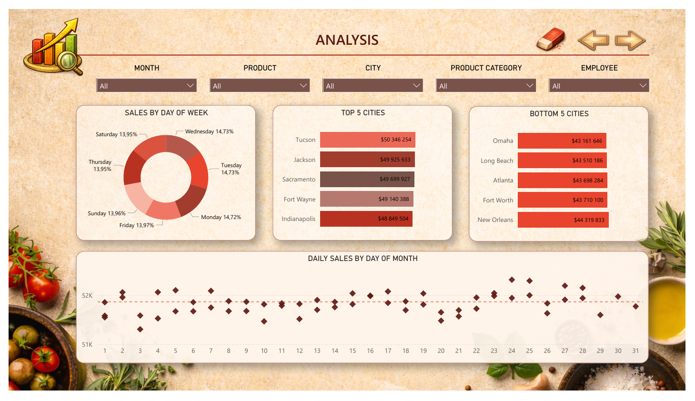

# Grocery Sales Analysis

Interaktív Power BI dashboard, amely egy élelmiszer-kiskereskedelmi vállalat értékesítési teljesítményét vizsgálja termékek, városok, alkalmazottak és időbeli trendek alapján. A riport célja az volt, hogy nagy mennyiségű értékesítési adatot átlátható és vizuálisan erős formában jelenítsen meg.

---

## 🏢 Háttér

Ez a projekt egy Power BI kihívás részeként készült, véletlenszerűen generált dataset felhasználásával. Emiatt az adatok bizonyos helyeken következetlenek, illetve több dimenzióban nem túl változatosak, ami korlátozta a mélyebb üzleti insightok és látványos trendek kialakítását.

A projekt során ezért nagy hangsúlyt fektettem a dashboard vizuális megjelenésére, a felhasználói élményre és a vizuális storytellingre. A vizuális arculat kialakításához AI-generált ikonokat és grafikai elemeket is használtam.

---

## ❓ Vizsgálati szempontok

A dashboard többek között az alábbi kérdésekre ad választ:

- Mely városok teljesítenek a legerősebben és leggyengébben?
- Megfigyelhető-e napi vagy szezonális mintázat az értékesítésben?
- Mely termékek és kategóriák generálják a legnagyobb bevételt?
- Vannak-e jelentős különbségek az alkalmazottak teljesítménye között?
- Hogyan oszlik meg a bevétel különböző korcsoportok között?

   
--- 

## 🛠️ Használt technológiák

- Power BI
- Power Query
- DAX
- Data Modeling
- KPI Visualization
- Interactive Filtering
- AI-generált vizuális elemek

---

## 🔧 Feladatok

- Adattisztítás és adattranszformáció
- Adatmodellezés Power BI környezetben
- KPI-ok és DAX measure-ök létrehozása
- Többoldalas interaktív dashboard kialakítása
- Egyedi vizuális koncepció és dashboard design megtervezése
- AI-generált ikonok integrálása a vizuális arculatba
- Interaktív szűrők és slicerek kialakítása
- Értékesítési és alkalmazotti teljesítmények összehasonlítása

---

## 📈 Főbb megállapítások

- A teljes bevétel jelentős része néhány kiemelt termékkategóriából származik
- A városok és alkalmazottak teljesítménye között jól látható különbségek figyelhetők meg
- A napi értékesítési adatok viszonylag kiegyensúlyozott eloszlást mutatnak
- A projekt egyik fő fókusza a vizuális storytelling és a professzionális dashboard megjelenés kialakítása volt

---

## 🎨 Dashboard Preview

A dashboard vintage grocery témájú vizuális stílust kapott, egyedi háttérelemekkel és AI-generált ikonokkal.

Oldalak:
- Analysis
- Products
- Employees

Minden oldal eltérő nézőpontból támogatja az értékesítési adatok elemzését.

