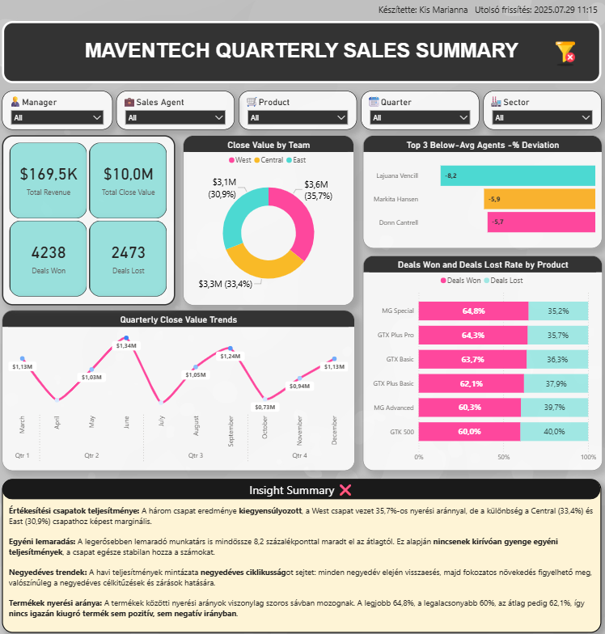

# MavenTech Quarterly Sales Summary
Interaktív Power BI jelentés, amely a MavenTech értékesítési osztályának teljesítményét vizsgálja negyedéves bontásban. A riport célja, hogy segítse a vezetői döntéseket az értékesítési folyamatok átláthatóságával.
  
## 🏢 Háttér
A MavenTech vállalat nagyvállalati ügyfelek számára kínál számítógépes hardvermegoldásokat. Egy új CRM-rendszert vezettek be, amelyben rögzítik az értékesítési lehetőségeket, azonban a nyers adatok önmagukban nem adnak teljes képet a csapatok eredményeiről.
    
## ❓ Vizsgálati szempontok
A dashboard a következő kérdésekre ad választ:

- **Mely értékesítési csapatok teljesítenek kiemelkedően — és kik maradnak le?**
- **Vannak-e látványos eltérések az egyéni teljesítmények között?**
- **Milyen mintázatok figyelhetők meg negyedéves lebontásban?**
- **Mely termékekhez tartoznak a legeredményesebb értékesítési lehetőségek?**

## 💡 Összegzés
Olyan vizualizációs dashboardot készítettem, amely kártyákon és különféle diagramokon keresztül mutatja be az értékesítési teljesítményt. A fő mutatók (bevétel, nyert/vesztett ügyletek) mellett arányokat és trendeket szemléltető grafikonok (sáv-, vonal-, oszlop- és kördiagram) segítik a gyors áttekintést. Interaktív szűrők révén a riport testreszabható, így célzott elemzés végezhető szerepkörök, termékek, időszakok vagy csapatok szerint.
